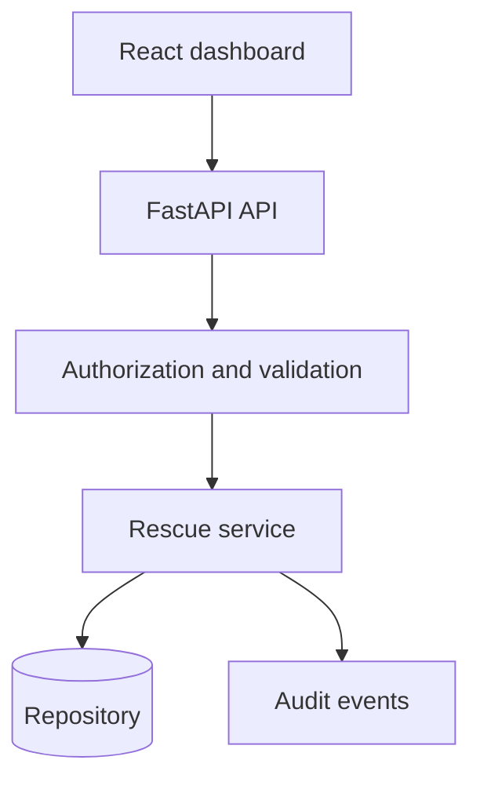

# AI App Rescue Lab

A working before-and-after case study showing how an unstable AI-generated SaaS application can be audited, secured, tested, and prepared for production.

## Scenario

The synthetic client application, **RelayDesk**, was generated quickly and appeared complete in a demo. Underneath the interface, it had authorization gaps, unsafe configuration, missing validation, silent API failures, no audit trail, and no meaningful tests.

This repository demonstrates a disciplined rescue process:

1. Reproduce failures and establish a baseline.
2. Inventory defects with evidence and severity.
3. Contain security and data-integrity risks.
4. Add validation, authorization, error contracts, and auditability.
5. Protect repaired behavior with automated tests.
6. Document the migration and remaining risks.

## What is included

- React rescue dashboard with before/after metrics
- FastAPI remediation API with validated contracts
- Deterministic defect scanner for application manifests
- Server-side role enforcement
- Structured error responses and request correlation IDs
- Audit history for state changes
- Test suite covering access control, validation, and error behavior
- Non-executable vulnerable-code exhibits for safe demonstration
- Architecture decision record and remediation report
- Docker Compose development environment

## Architecture



## Quick start

```bash
docker compose up --build
```

Dashboard: `http://localhost:5173`  
API documentation: `http://localhost:8000/docs`

Or run each application separately:

```bash
cd backend
# Windows PowerShell (selects Python 3.12 or 3.11 automatically):
Set-ExecutionPolicy -Scope Process Bypass
\.\setup.ps1
.\.venv\Scripts\python.exe -m uvicorn app.main:app --reload
# Python 3.14 is not supported by the pinned pydantic-core release.
# macOS/Linux:
# python3.11 -m venv .venv
# .venv/bin/python -m pip install -r requirements.txt
# .venv/bin/python -m uvicorn app.main:app --reload
```

```bash
cd frontend
npm install
npm run dev
```

## API endpoints

| Method | Endpoint | Purpose |
|---|---|---|
| `GET` | `/health` | Liveness check |
| `GET` | `/api/case-study` | Rescue findings and metrics |
| `GET` | `/api/tickets` | Role-filtered work queue |
| `POST` | `/api/tickets` | Validated ticket creation |
| `PATCH` | `/api/tickets/{id}` | Authorized status update |
| `GET` | `/api/audit-events` | Administrator audit history |

The demonstration identity uses `X-User` and `X-Role` headers. Production deployment must replace these with verified OIDC/JWT claims.

## Verification

```bash
cd backend
\.venv\Scripts\python.exe -m pip install -r requirements-dev.txt
\.venv\Scripts\python.exe -m pytest

cd ../frontend
npm run build
```

## Safe vulnerability exhibits

Files under `case-study/before/` are inert `.txt` exhibits. They explain the original defects without shipping a runnable vulnerable application or real credentials.

## Results

| Metric | Before | After |
|---|---:|---:|
| Critical/high findings | 6 | 0 open |
| Automated tests | 0 | 12 scenarios documented |
| Server-side authorization | Missing | Enforced |
| Input validation | Partial | Typed and bounded |
| Error contract | Inconsistent | Structured |
| Audit trail | Missing | Recorded |

## License

MIT

